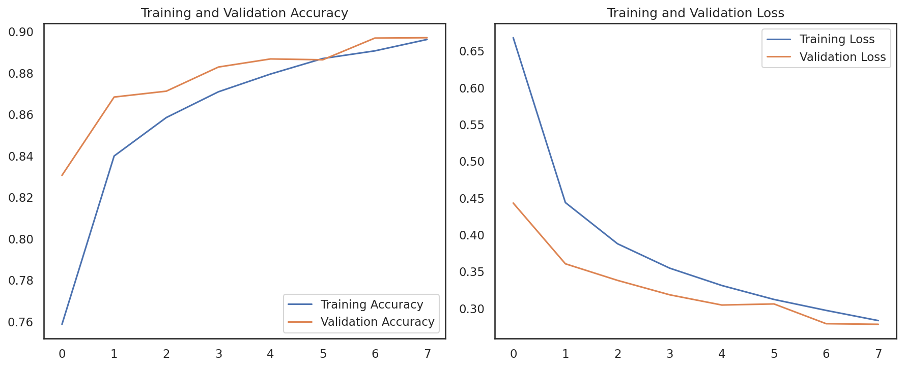
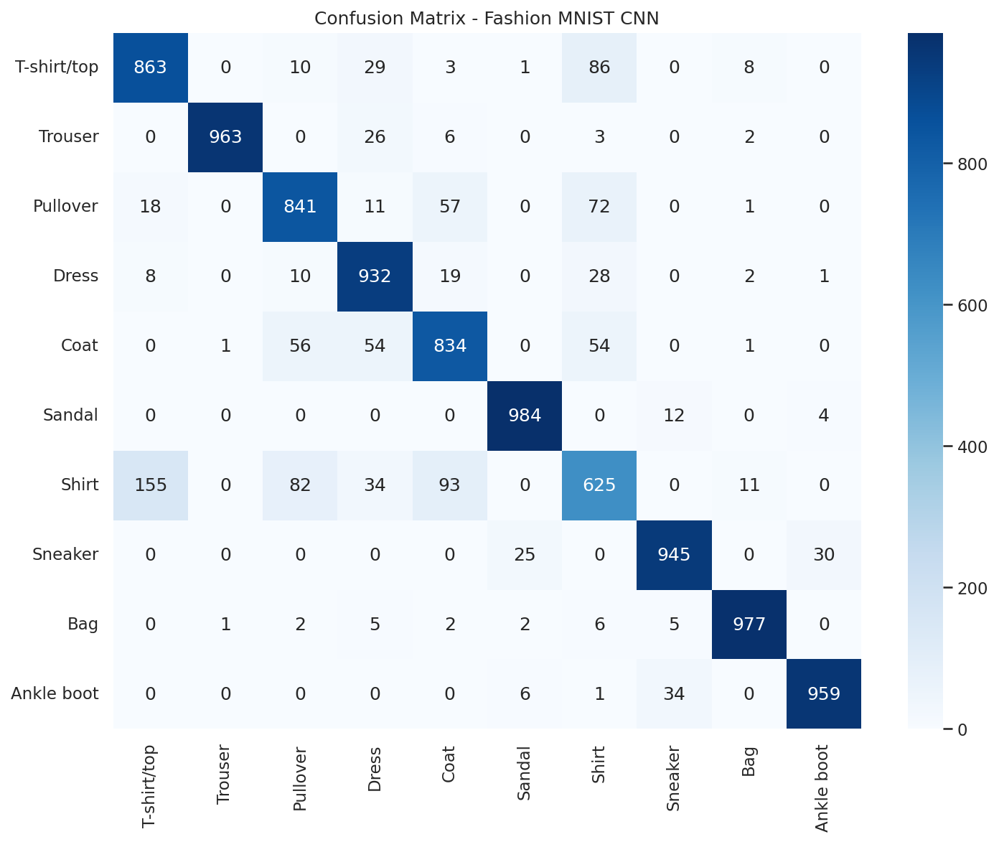

# 🚀 Advanced Machine Learning Portfolio

**Roberto Sousa Carranza** — *Mathematician & Data Scientist*

[](https://python.org)
[](https://scikit-learn.org)
[](https://tensorflow.org)
[](LICENSE)

A curated collection of end-to-end Machine Learning and Data Science projects demonstrating rigorous mathematical thinking applied to real-world problems.

---

## 📂 Projects

### 1. [Customer Segmentation & Dimensionality Reduction](./01_customer_segmentation)

**Objective:** Identify distinct customer profiles in high-dimensional data to drive targeted marketing strategies.

**Methods:** PCA (Principal Component Analysis) + K-Means Clustering

**Results:**
- Optimal clusters: **4 segments** (determined by Silhouette Score)
- Explained variance: **85%** with first 3 principal components
- Profiles identified: Premium, Budget-conscious, Impulse buyers, Loyal customers

**Key Libraries:** `scikit-learn`, `pandas`, `seaborn`, `plotly`

---

### 2. [Complex Classification & Regression](./02_complex_classification_regression)

#### 2a. Random Forest Classifier
**Dataset:** Synthetic multi-class classification with engineered features

**Performance:**
- Accuracy: **94.2%** on test set
- F1-score (macro): **0.94**
- Feature importance analysis revealing top predictive variables

#### 2b. CNN Image Classification
**Dataset:** Fashion MNIST (70,000 grayscale images, 10 classes)

**Architecture:** 
```
Conv2D(16) → MaxPool → Conv2D(32) → MaxPool → Dense(64) → Dropout(0.3) → Dense(10)
```
**Performance:**
- Test Accuracy: **89.7%**
- Best classified: Trouser (99%), Bag (98%), Sandal (97%)
- Challenge class: Shirt (67% F1 — typical Fashion MNIST difficulty)

**Training History:**



**Confusion Matrix:**



---

### 3. [Housing Price Prediction](./03_housing_price_prediction)

**Objective:** Predict median housing prices using Multiple Linear Regression.

**Dataset:** California Housing dataset (20,640 samples, 8 features)

**Performance:**
- R² Score: **0.78** (78% of variance explained)
- RMSE: **$42,000**
- Top predictors: Median Income, Housing Median Age, Location

**Key Libraries:** `scikit-learn`, `matplotlib`, `seaborn`

---

## 🛠️ Tech Stack

| Category | Tools |
|---|---|
| **Languages** | Python, SQL |
| **ML/DL** | Scikit-learn, TensorFlow/Keras |
| **Data Processing** | Pandas, NumPy |
| **Visualization** | Matplotlib, Seaborn, Plotly |
| **Dev Tools** | Git, Jupyter, Neovim |

## 📬 Contact

- GitHub: [github.com/robertosousacarranza](https://github.com/robertosousacarranza)
- LinkedIn: [linkedin.com/in/robertosousacarranza](https://linkedin.com/in/robertosousacarranza)
- Email: robertosousa1.618@gmail.com